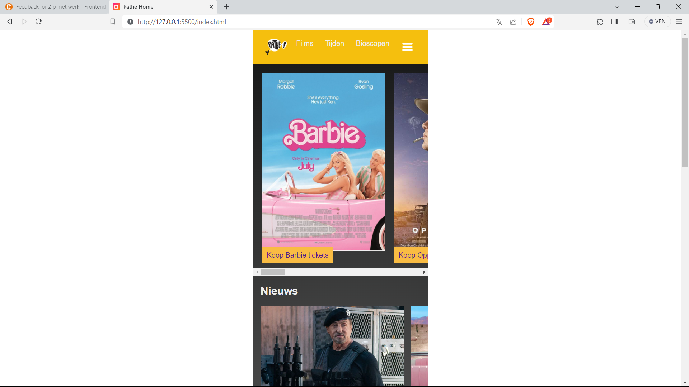
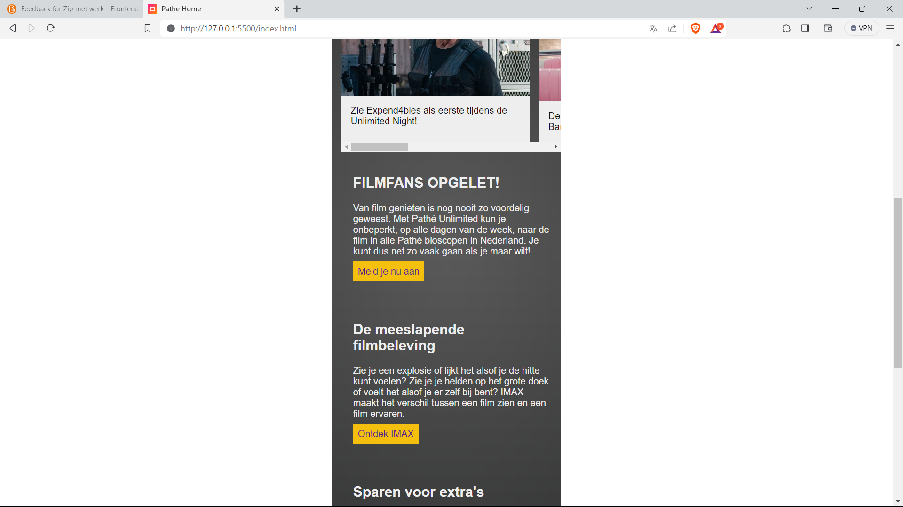
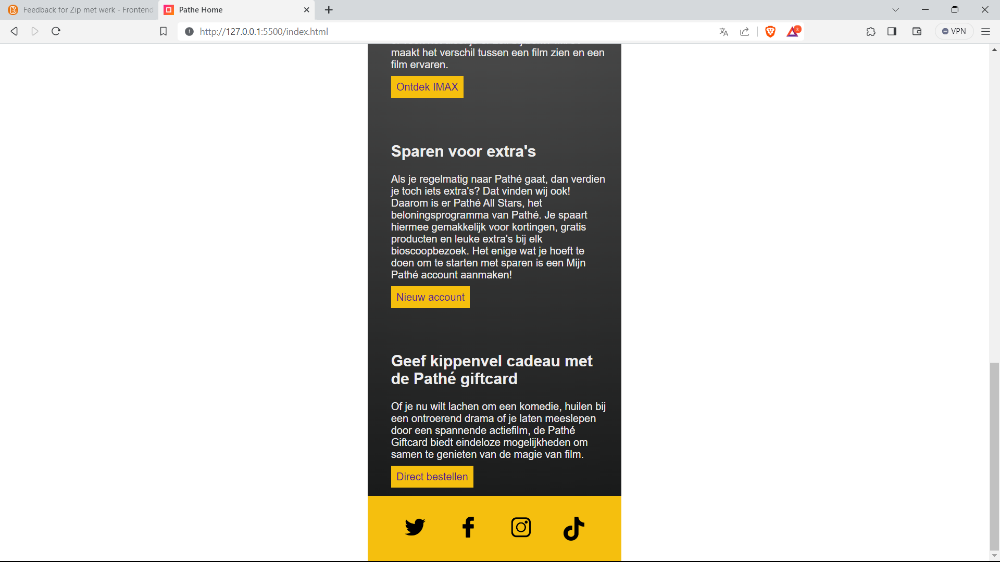
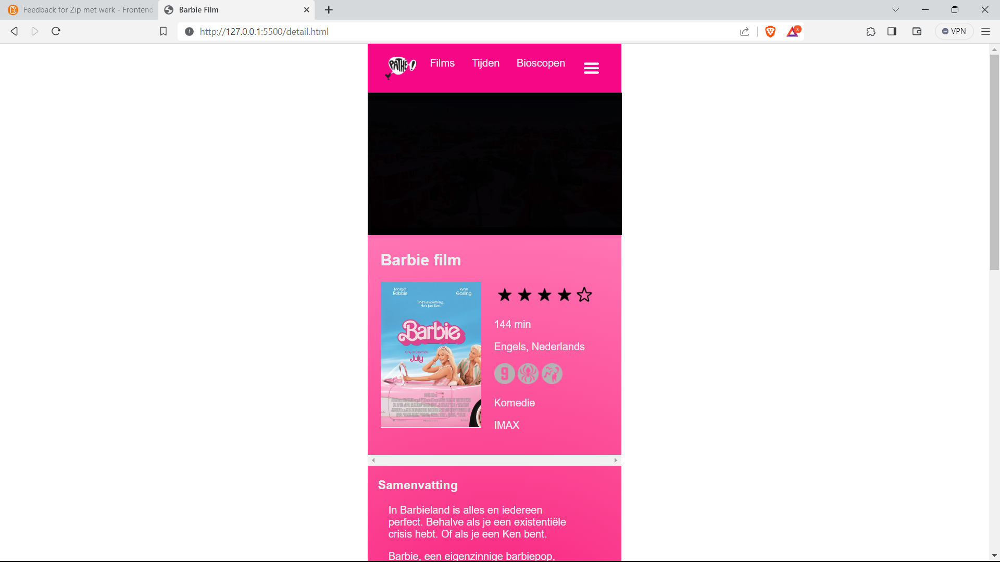
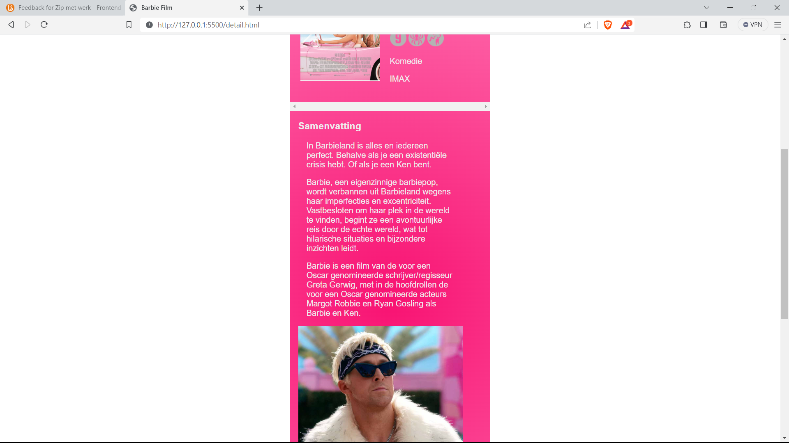
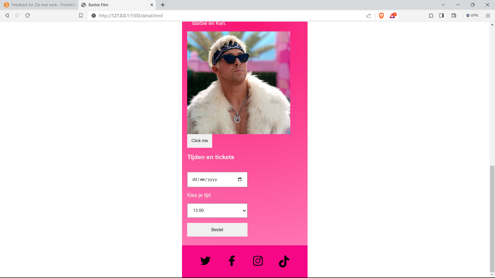
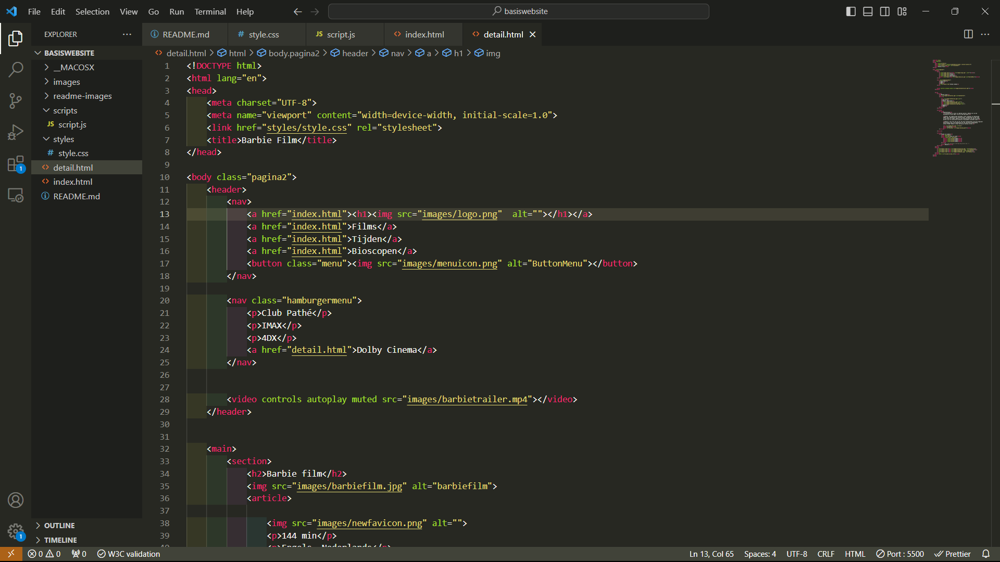
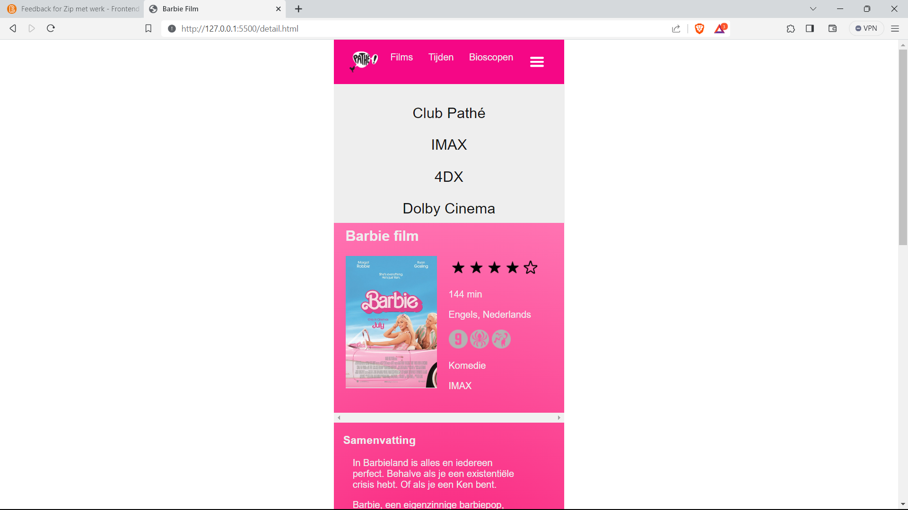

# Procesverslag
Markdown is een simpele manier om HTML te schrijven.  
Markdown cheat cheet: [Hulp bij het schrijven van Markdown](https://github.com/adam-p/markdown-here/wiki/Markdown-Cheatsheet).

Nb. De standaardstructuur en de spartaanse opmaak van de README.md zijn helemaal prima. Het gaat om de inhoud van je procesverslag. Besteedt de tijd voor pracht en praal aan je website.

Nb. Door *open* toe te voegen aan een *details* element kun je deze standaard open zetten. Fijn om dat steeds voor de relevante stuk(ken) te doen.

## Jij

  
uitwerken voor kick-off werkgroep

  ### Auteur:
  Ebru Turkmen

  #### Je startniveau:
  Blauw piste
  #### Je focus:
  Surface Plane

## Je website

  
uitwerken voor kick-off werkgroep

  ### Je opdracht:
  https://www.pathe.nl/

  #### Screenshot(s) van de eerste pagina (small screen): 
  Home pagina  
  

  #### Screenshot(s) van de tweede pagina (small screen):
  Detail pagina  
  
 

## Toegankelijkheidstest 1/2 (week 1)

  
uitwerken na test in 2e werkgroep

  ### Bevindingen
  Lijst met je bevindingen die in de test naar voren kwamen:
  Bevindingen screenreader:
  1. Hij geeft niet altijd aan wat voor knop het is.
  2. Hij leest geen platte tekst voor.
  3. Bij films staan er categoriën en dat leest ie niet voor.
  4. Bij de film pagina zijn er geen pijltjes bij de foto's en cast.
  5. Er is geen H1 gebruikt.
  6. Er is niet gebruikt gemaakt van een list item.
  7. Er wordt bijna geen alt attribute gebruikt. 
  
  
  
  
  

## Breakdownschets (week 1)

  
uitwerken na afloop 3e werkgroep

  ### de hele pagina: 
  
  
  ### de hele pagina: 
  

## Voortgang 1 (week 2)

  
uitwerken voor 1e voortgang

  ### Stand van zaken
  hier dit ging goed & dit was lastig (neem ook screenshots op van delen van je website en code)
  
  1. Het schrijven van HTML voor mijn eerste pagina verliep soepel. Het was niet helemaal semantisch correct. Ik had beter moeten letten op 
  het gebruik van section en article. Met de kennis die ik nu heb, kan ik zorgvuldig mijn tweede pagina semantisch correct schrijven.
  
  

  ### Agenda voor meeting
  samen met je groepje opstellen

  | student 1      | student 2          | student 3    | student 4        | Student 5     |
  | Marina         | Max                | Ebru         | Niels            | Robin         |
  | Wilt vragen    | Heeft een vraag    | Ik heb een   | Vraag over het   | Gaat vragen   |
  | stellen over   | over het mondeling.| vraag over   | invulformulier.  | stellen over  |
  | haar html of   |                    | mijn Html of |                  | de header en  |
  | het clean is   |                    | het goed is. |                  |responsiveness.|            
  | en of alles op |                                                       
  | het juiste plek|
  | staat.         |

  ### Verslag van meeting
  hier na afloop snel de uitkomsten van de meeting vastleggen
  - Je kan de logo als heading 1 gebruiken.
  - Gradiant kleur fixen in CSS. 
  - Voor invulformulier is het handig om een label te gebruiken.

## Voortgang 2 (week 3)

  
uitwerken voor 2e voortgang

  ### Stand van zaken
  hier dit ging goed & dit was lastig (neem ook screenshots op van delen van je website en code)
  1. Ik had een beetje moeite mee met mijn layout. Het was niet hoe ik het wilde. Alles wordt niet netjes uitegelijnd of het
  wordt verschuift. 
  

  ### Agenda voor meeting
  samen met je groepje opstellen

  | student 1      | student 2          | student 3     | student 4        | Student 5        |
  | Marina         | Max                | Ebru          | Niels            | Robin            |
  | Heeft persoon- | Heeft geen vraag.  | Ik heb een    | heeft een vraag  | Was niet aanwezig|
  | lijke vragen   |                    | vraag of het  | over ...         |                  |
  |                |                    | duidelijk is  |                  |                  |
  |                |                    | dat je op een |
  |                |                    | film kan      |
  |                |                    | klikken.      |                             

  ### Verslag van meeting
  hier na afloop snel de uitkomsten van de meeting vastleggen
  - Het is nog niet duidelijk dat je erop kan klikken (als je een film kiest). Dus ik kan hierbij een button toevoegen of een (a)
  - Je moet opletten welke maten je gebruikt. (zoals PX, EM)

## Toegankelijkheidstest 2/2 (week 4)

  
uitwerken na test in 9e werkgroep

  ### Bevindingen
  Lijst met je bevindingen die in de test naar voren kwamen (geef ook aan wat er verbeterd is):
  1. Ik heb de headings gefixed. Ze staan allemaal op goeie volgorde. 
  2. Ik heb een video die afspeelt, maar begint zonder geluid. Hierdoor schrikken mensen niet.
  3. Alt tekst is toegevoegd, waar het nodig is.
  4. Voor buttons is er een aria label toegevoegd.
  5. Je hebt een keuze voor dark en light mode.
  
  
  
  
  

## Voortgang 3 (week 4)

  
uitwerken voor 3e voortgang

  ### Stand van zaken
  hier dit ging goed & dit was lastig (neem ook screenshots op van delen van je website en code)
  1. Ik ben ver gekomen met mijn 1e pagina. Alleen de layout nog fixen en mijn top nav en mijn footer. Moet nog wel veel voor mijn 2e pagina doen. 

  ### Agenda voor meeting
  samen met je groepje opstellen

  | student 1      | student 2          | student 3     | student 4          |Student 5         |
  | Marina         | Max                | Ebru          | Niels              | Robin            |
  | Heeft persoon- | Heeft persoonlijke | Ik heb een    | heeft persoonlijke | Was niet aanwezig|
  | lijke vragen   | vraag              | vraag of mijn | vraag              |                  |
  |                |                    | html goed is  |                    |                  |
  |                |                    |               |                    |
  |                |                    |               |                    |
  |                |                    |               |  
  |                |                    |               |               

  ### Verslag van meeting
  hier na afloop snel de uitkomsten van de meeting vastleggen

  - Op mijn body moest er een margin op 0 staan. Zo kreeg ik geen witte rand omheen. 
  - Bij de div moet er een gap staan inplaats van margin left. 
  - Margin bottom overal weghalen, want dat verplaatst alles en daarvoor moet ik bij de image display block zetten.

## Eindgesprek (week 5)

  
uitwerken voor eindgesprek

  ### Je uitkomst - karakteristiek screenshots:
  
  
  
  

 ### Je uitkomst - karakteristiek screenshots nieuwe versie:
  
  
  
  
  
  

  ### Dit ging goed/Heb ik geleerd: 
  Korte omschrijving met plaatjes
  
  1. Mijn eerste pagina verliep over het algemeen vrij soepel. Ik ben tevreden over de lay-out en de manier waarop ik de elementen heb georganiseerd. Tijdens het proces heb ik geleerd hoe ik de :root-selector in CSS moet gebruiken, wat erg handig bleek te zijn voor het implementeren van zowel de donkere als lichte modus, die ik uiteindelijk heb toegevoegd. Daarnaast heb ik ook geleerd hoe ik de nth-type-selector moet toepassen, terwijl ik normaal gesproken direct een class zou gebruiken.

  ### Dit was lastig/Is niet gelukt:
  Korte omschrijving met plaatjes
  1. Het coderen is over het algemeen een uitdaging voor mij. Het kost me veel moeite en tijd om nieuwe concepten te leren en ze toe te passen. Ik merk dat ik vaak vastloop op bepaalde punten en snel in de war raak, waardoor ik het overzicht verlies. Hoewel ik vaak leuke ideeën heb, besef ik dat mijn huidige vaardigheden niet voldoende zijn om ze te realiseren. Een voorbeeld hiervan is mijn poging om een volledig werkend hamburgermenu te maken. Ik heb het geprobeerd, maar vanwege tijdsbeperkingen heb ik besloten om ermee te stoppen. Ik heb ook een tutorial gevolgd, maar begreep niet volledig wat er precies gebeurde.

## Herkansing
  
  
Ik heb een micro interactie toegevoegd en nu heb ik een goed werkend hamburgermenu. Dit was behoorlijke uitdaging, want ik kreeg te maken
met veel foutmeldingen, voornamelijk veroorzaakt door JavaScript. Uiteindelijk is alles goed gekomen. Bovendien ging mijn website
plotseling stuk, waardoor ik de hele layout van mijn tweede pagina opnieuw moest herstellen. Ik was op dat moment erg gefrustreerd.

## Bronnenlijst

  
continu bijhouden terwijl je werkt

  Nb. Wees specifiek ('css-tricks' als bron is bijv. niet specifiek genoeg). 
  Nb. ChatGpT en andere AI horen er ook bij.
  Nb. Vermeld de bronnen ook in je code.

  1. https://www.w3schools.com/tags/tag_select.asp
  2. https://developer.mozilla.org/en-US/docs/Web/CSS/CSS_Animations/Using_CSS_animations
  3. Dlo
  4. Mede studenten
  5. Docent

